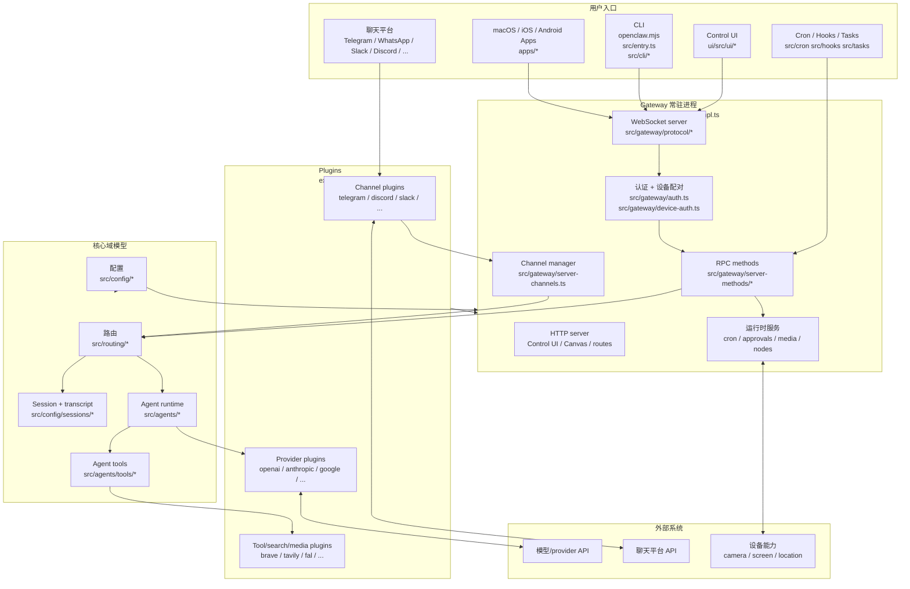
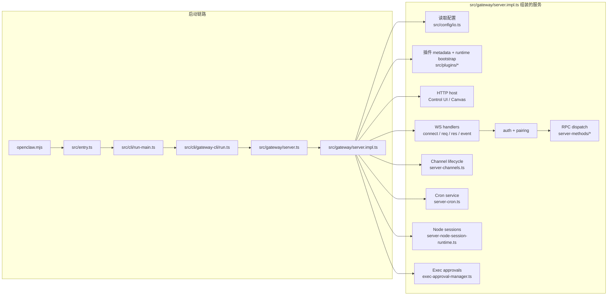
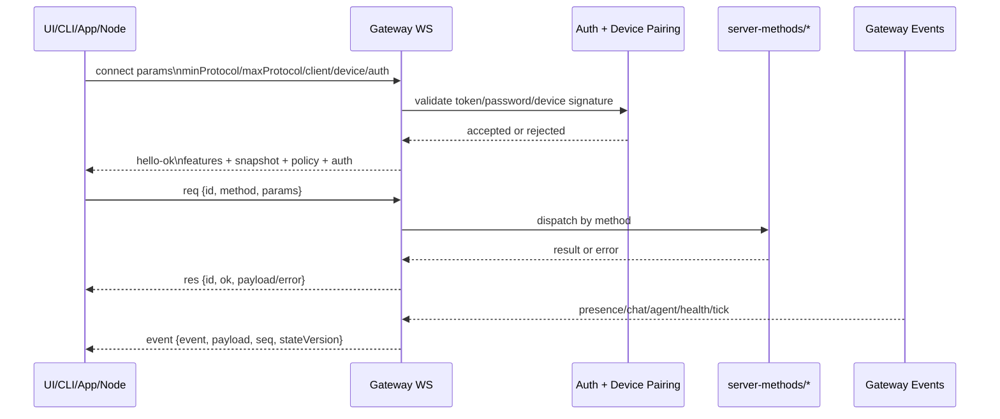
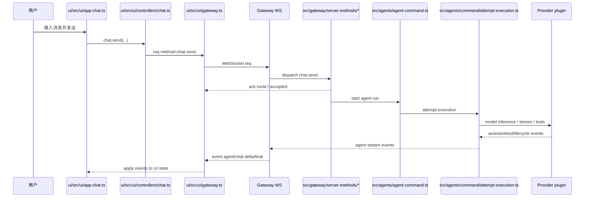
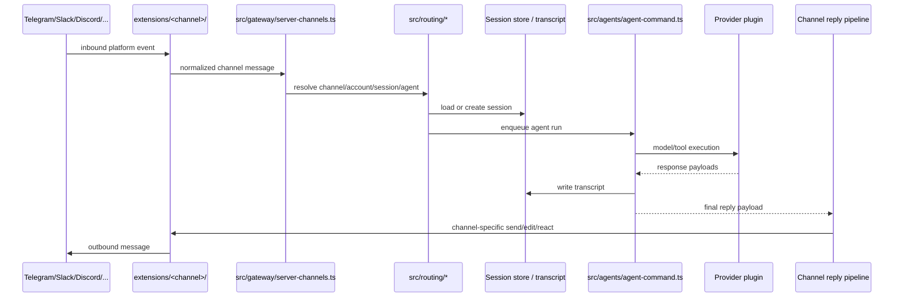
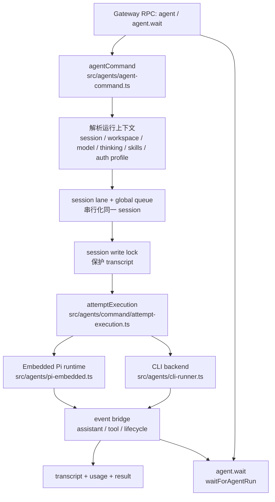
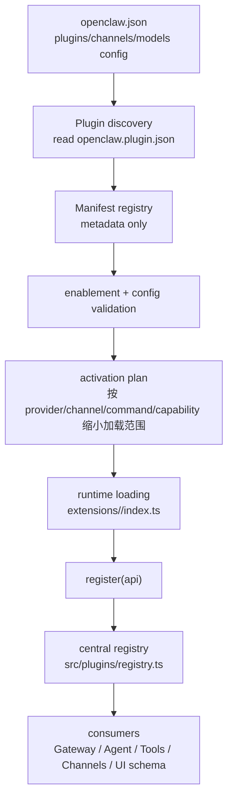
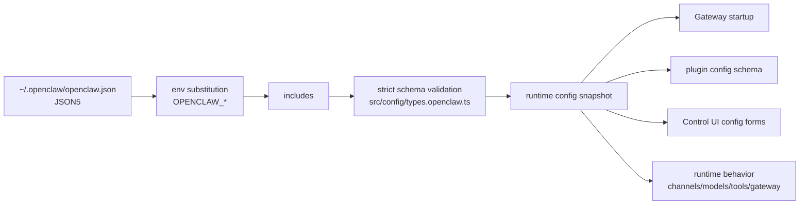

# 12. 具体架构图

这篇比 `11-project-structure-diagram.md` 更细。重点不是列目录，而是把“请求从哪里来、经过哪些模块、最后到哪里去”画清楚。

## 图 1：整体系统架构



怎么读这张图：

- 左边是入口：用户可能从聊天平台、浏览器、CLI、App 或自动化任务进来。
- 中间是 Gateway：它负责认证、协议、RPC、频道生命周期和运行时服务。
- 下方是核心域模型：配置、路由、session、Agent、tools。
- 右边是 plugins 和外部系统：具体 provider、聊天平台、搜索、媒体都在插件侧。

## 图 2：Gateway 内部更细结构



重点：

- `src/gateway/server.ts` 是轻入口，实际重活在 `src/gateway/server.impl.ts`。
- Gateway 启动时会同时准备 config、plugin、HTTP、WebSocket、channel、cron、node、approval 等服务。
- 外部调用不是随便进内部函数，而是走 WebSocket frame，再分发到 `src/gateway/server-methods/*`。

## 图 3：WebSocket 协议结构



对应源码：

- frame schema：`src/gateway/protocol/schema/frames.ts`
- 协议汇总和 validator：`src/gateway/protocol/index.ts`
- 浏览器客户端：`ui/src/ui/gateway.ts`
- Gateway client：`src/gateway/client.ts`

## 图 4：Control UI 发一条消息



为什么 `chat.send` 不是直接返回最终文本：

- Agent run 可能很久。
- 回复可能是流式的。
- 工具调用、生命周期、错误、最终消息都需要通过事件持续推给 UI。
- 所以先返回 `runId`，后续通过 `event` 更新界面。

## 图 5：聊天平台消息进入 Agent



这个图的边界很重要：

- 平台细节在 `extensions/<channel>/`。
- Gateway 只处理通用 channel/session/agent 合同。
- 发送回平台时，也要回到 channel plugin 做平台格式转换。

## 图 6：Agent runtime 内部



Agent run 主要做这些事：

- 解析 session、workspace、模型、skills、auth profile。
- 用队列保证同一个 session 不并发乱写。
- 加 session write lock 保护 transcript。
- 根据 provider/runtime 走 embedded Pi runtime 或 CLI backend。
- 把 assistant/tool/lifecycle 事件桥接回 Gateway。

## 图 7：Plugin 加载和能力注册



插件分两层看：

- control plane：只读 manifest，不执行插件代码，用来发现、校验、规划。
- runtime plane：加载 `index.ts`，执行 `register(api)`，把 provider/channel/tool/media/search 等能力注册进 registry。

常见注册点：

```text
api.registerProvider(...)
api.registerCliBackend(...)
api.registerChannel(...)
api.registerWebSearchProvider(...)
api.registerWebFetchProvider(...)
api.registerImageGenerationProvider(...)
api.registerSpeechProvider(...)
```

## 图 8：配置如何影响运行



对应源码：

- config 类型：`src/config/types.openclaw.ts`
- config 读写：`src/config/io.ts`
- config 路径：`src/config/paths.ts`
- plugin config schema：`extensions/*/openclaw.plugin.json`

## 图 9：新手最该先掌握的 5 条链路

```text
1. 启动链路
   openclaw.mjs
   -> src/entry.ts
   -> src/cli/run-main.ts
   -> src/cli/gateway-cli/run.ts
   -> src/gateway/server.ts
   -> src/gateway/server.impl.ts

2. UI 请求链路
   ui/src/ui/views/*
   -> ui/src/ui/controllers/*
   -> ui/src/ui/gateway.ts
   -> src/gateway/server-methods/*

3. Agent 执行链路
   src/gateway/server-methods/*
   -> src/agents/agent-command.ts
   -> src/agents/command/attempt-execution.ts
   -> provider plugin / embedded runtime / CLI backend

4. 插件链路
   extensions/<id>/openclaw.plugin.json
   -> extensions/<id>/index.ts
   -> src/plugin-sdk/plugin-entry.ts
   -> src/plugins/registry.ts

5. 协议链路
   src/gateway/protocol/schema/frames.ts
   -> src/gateway/protocol/index.ts
   -> ui/src/ui/gateway.ts
   -> src/gateway/client.ts
```

## 验证命令

```bash
node scripts/docs-list.js
rg "ConnectParamsSchema|RequestFrameSchema|EventFrameSchema" src/gateway/protocol
rg "agentCommand" src/agents src/gateway
rg "attemptExecution|runEmbeddedPiAgent|runCliAgent" src/agents
rg "definePluginEntry|registerProvider|registerChannel" src/plugin-sdk src/plugins extensions
rg "chat.send|agent.wait" ui/src src/gateway
```

## 资料来源

- `docs/concepts/architecture.md`
- `docs/concepts/agent-loop.md`
- `docs/plugins/architecture.md`
- `src/gateway/protocol/schema/frames.ts`
- `.workplace/learn/11-project-structure-diagram.md`
