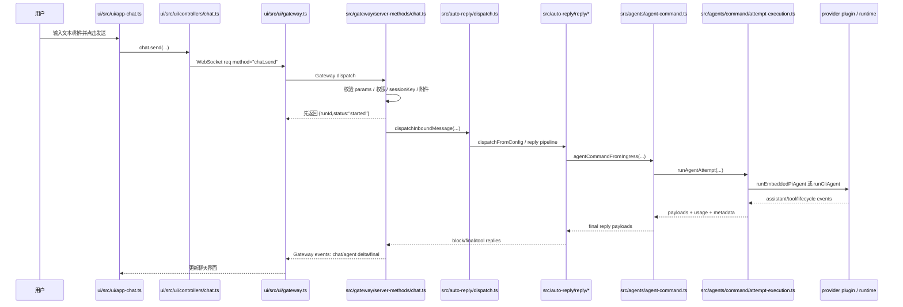
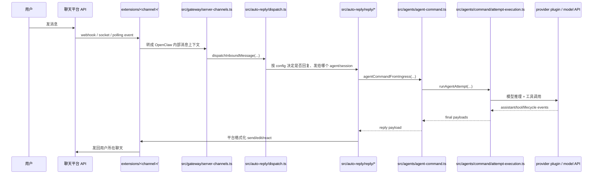
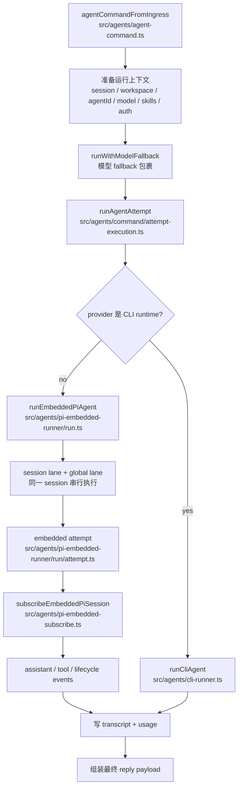

# 13. 用户发送一条消息后的执行链路

这篇只回答一个问题：用户发出一条消息后，OpenClaw 内部到底经历了哪些步骤。

## 先记住主线

一条消息不是直接调用模型。它会先进入 Gateway，经过认证、会话、路由、回复管线，再进入 Agent runtime。Agent 执行时会加载上下文、skills、工具和模型 provider，过程中不断发事件，最后把回复写入 transcript 并发回 UI 或聊天平台。

```text
用户消息
  -> 入口适配层
  -> Gateway
  -> session / routing
  -> auto-reply dispatch
  -> agentCommandFromIngress
  -> agentCommand
  -> runAgentAttempt
  -> runEmbeddedPiAgent 或 runCliAgent
  -> assistant/tool/lifecycle events
  -> transcript
  -> UI 或聊天平台回复
```

## 情况 A：用户在 Control UI 里发送



关键点：

- `chat.send` 不是等模型完整回复后才返回。
- 它会先返回 `runId` 和 `status`，让 UI 知道这次 run 已经开始。
- 真正的模型输出通过 Gateway events 流式回到 UI。
- 附件、图片、stop command、idempotency、abort controller 都在 `src/gateway/server-methods/chat.ts` 里处理。

## Control UI 链路对应源码

```text
ui/src/ui/app-chat.ts
  -> ui/src/ui/controllers/chat.ts
  -> ui/src/ui/gateway.ts
  -> src/gateway/server-methods/chat.ts
  -> src/auto-reply/dispatch.ts
  -> src/auto-reply/reply/dispatch-from-config.ts
  -> src/auto-reply/reply/agent-runner-execution.ts
  -> src/agents/agent-command.ts
  -> src/agents/command/attempt-execution.ts
```

## 情况 B：用户从 Telegram / Slack / Discord 等频道发送



频道入口和 UI 入口的区别：

- UI 入口已经是 Gateway WebSocket RPC，所以直接进 `chat.send`。
- 频道入口先由对应 plugin 处理平台事件，再交给 Gateway channel manager。
- 两者都会进入 auto-reply / Agent 执行链路。

## Agent 执行内部



Agent 执行阶段做的事：

- 解析 sessionKey/sessionId，找到这次对话属于哪个 session。
- 解析 agentId，决定用哪个 agent 的 workspace、模型和配置。
- 准备 workspace。
- 加载 skills snapshot。
- 解析 provider/model、thinking、verbose、trace、auth profile。
- 决定走 embedded Pi runtime 还是 CLI backend。
- 同一个 session 通过 session lane 串行化，避免 transcript 和工具状态乱序。
- 订阅模型/工具事件，把它们桥接成 OpenClaw 的 `assistant`、`tool`、`lifecycle` 事件。
- 写 transcript 和 usage。

## 为什么要先返回 runId

`chat.send` 在 Gateway 里会尽早返回：

```text
{ runId: clientRunId, status: "started" }
```

原因：

- 模型可能流式输出，需要边生成边显示。
- 工具调用可能耗时很长。
- 用户可能中途点击停止，对应 `chat.abort`。
- 浏览器刷新后也可以根据 `runId` 和 session 继续接事件。
- `agent.wait` 可以单独等待某个 run 结束，但等待不是发送消息本身的默认行为。

## 事件怎么回到用户

```text
assistant delta
  -> Gateway agent/chat event
  -> Control UI 更新正在生成的文本

tool event
  -> Gateway tool/agent event
  -> UI 或支持的客户端显示工具状态

lifecycle end/error
  -> Gateway final event
  -> UI 标记完成，或频道发送最终回复
```

## 最简源码阅读顺序

如果你只想追一条 UI 消息，按这个顺序：

1. `ui/src/ui/app-chat.ts`
2. `ui/src/ui/controllers/chat.ts`
3. `src/gateway/server-methods/chat.ts`
4. `src/auto-reply/dispatch.ts`
5. `src/auto-reply/reply/dispatch-from-config.ts`
6. `src/auto-reply/reply/agent-runner-execution.ts`
7. `src/agents/agent-command.ts`
8. `src/agents/command/attempt-execution.ts`
9. `src/agents/pi-embedded-runner/run.ts`
10. `src/agents/pi-embedded-runner/run/attempt.ts`
11. `src/agents/pi-embedded-subscribe.ts`

如果你想追一条 Telegram 这类频道消息，先看：

1. `extensions/<channel>/index.ts`
2. `src/gateway/server-channels.ts`
3. 然后接上 `src/auto-reply/dispatch.ts`

## 关键源码锚点

- `src/gateway/server-methods/chat.ts`：`"chat.send"` handler。
- `src/auto-reply/dispatch.ts`：`dispatchInboundMessage(...)`。
- `src/auto-reply/reply/agent-runner-execution.ts`：真正触发 agent run 的 auto-reply 层。
- `src/agents/agent-command.ts`：`agentCommandFromIngress(...)` 和 `agentCommand(...)`。
- `src/agents/command/attempt-execution.ts`：选择 `runCliAgent(...)` 或 `runEmbeddedPiAgent(...)`。
- `src/agents/pi-embedded-runner/run.ts`：session lane / global lane 串行执行。
- `src/agents/pi-embedded-runner/run/attempt.ts`：创建工具、prompt、Pi session，启动一次 embedded attempt。
- `src/agents/pi-embedded-subscribe.ts`：把 Pi runtime 事件转成 OpenClaw assistant/tool/lifecycle 事件。

## 验证命令

```bash
node scripts/docs-list.js
rg '"chat.send"' src/gateway/server-methods/chat.ts
rg "dispatchInboundMessage" src/auto-reply src/gateway
rg "agentCommandFromIngress|agentCommand" src/agents src/gateway src/auto-reply
rg "runCliAgent|runEmbeddedPiAgent" src/agents/command src/agents
rg "subscribeEmbeddedPiSession" src/agents
```

## 资料来源

- `.workplace/learn/02-runtime-flow.md`
- `docs/concepts/agent-loop.md`
- `src/gateway/server-methods/chat.ts`
- `src/auto-reply/dispatch.ts`
- `src/agents/agent-command.ts`
- `src/agents/command/attempt-execution.ts`
- `src/agents/pi-embedded-runner/run.ts`
- `src/agents/pi-embedded-runner/run/attempt.ts`
- `src/agents/pi-embedded-subscribe.ts`
