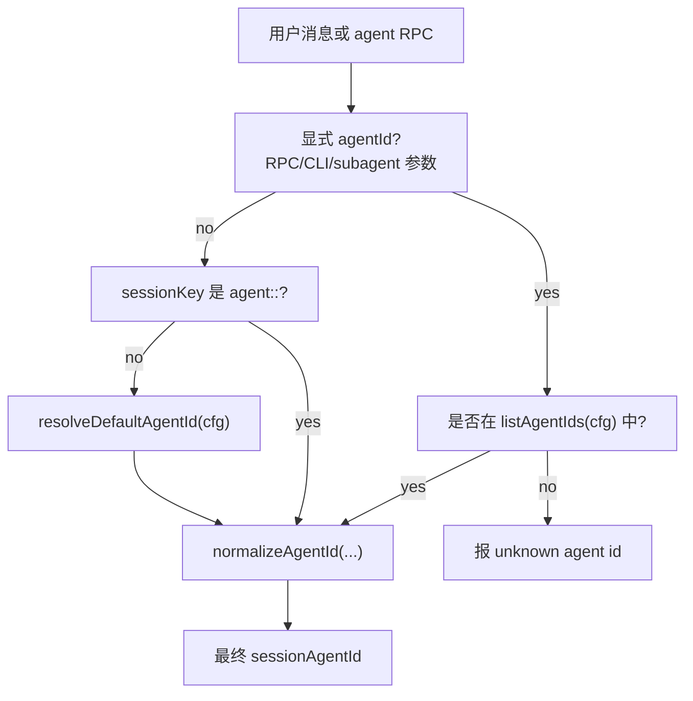

# 14. agentId 是怎么解析的

这篇回答两个问题：

- OpenClaw 如何从一条消息解析出 `agentId`。
- 项目里“有哪些 Agent”从哪里来。

## 先给结论

`agentId` 不是模型名，也不是插件名。它是一个 Agent 的身份 ID，用来决定这次消息使用哪个 Agent 的 workspace、agentDir、模型配置、skills、工具策略、auth profile 和 session store。

默认 `agentId` 是：

```text
main
```

核心常量在：

```text
src/routing/session-key.ts
```

```ts
export const DEFAULT_AGENT_ID = "main";
```

## 为什么要有 agentId

你可以把 `agentId` 理解成“AI Agent 的用户 ID / 租户 ID”。它不是为了多存一个字段，而是为了把不同 Agent 的运行范围隔离开。

如果没有 `agentId`，所有消息都会挤在同一个默认身份里：

- 不同用途的 Agent 会共用同一套 workspace，工作文件容易混在一起。
- 聊天历史和 session store 无法区分是谁的上下文。
- 模型、skills、工具权限、sandbox 策略、auth profile 很难按 Agent 分开。
- 聊天平台进来的消息不知道该交给哪个 Agent。
- 多 Agent 场景下，`work`、`support`、`family` 这类身份只能靠临时字符串或额外逻辑拼出来，系统会越来越乱。

所以 `agentId` 的核心意义是：**给一次 Agent 执行确定一个清晰的作用域**。

换句话说，你说的“区别身份、进行数据隔离”是对的，但还不完整。更准确的说法是：

```text
agentId = Agent 运行作用域的主键
```

这个“作用域”里面既包含身份，也包含数据、路由、权限和运行配置：

- 身份：这次是谁在回复，比如 `main`、`work`、`support`。
- 数据：使用哪个 workspace、agentDir、session store、聊天历史。
- 路由：聊天平台来的消息应该交给哪个 Agent。
- 权限：这个 Agent 能用哪些 tools、skills、sandbox 策略。
- 配置：这个 Agent 默认用什么模型、auth profile 和运行参数。

所以它不是单纯为了“显示不同名字”，而是为了让系统在每次执行前都能确定：

```text
这条消息属于哪个 Agent 的世界？
```

简化后可以这样看：

```text
用户消息
  -> 解析 agentId
  -> 找到这个 Agent 的 workspace / agentDir / 模型 / tools / skills / auth profile / session
  -> 用这个 Agent 的身份执行
  -> 把结果写回这个 Agent 对应的 session 和聊天通道
```

更具体一点，`agentId` 主要解决这些问题：

- **身份隔离**：`main`、`work`、`support` 可以有不同名字、身份文件和默认行为。
- **上下文隔离**：每个 Agent 可以有自己的 workspace、记忆文件、会话历史。
- **权限隔离**：不同 Agent 可以开放不同 tools、skills、sandbox、模型权限。
- **凭据隔离**：模型 auth profile 存在 agent 作用域下，避免所有 Agent 共用一份登录/密钥状态。
- **路由隔离**：同一个 Gateway 可以接多个聊天平台账号或群聊，通过绑定规则把消息交给不同 Agent。
- **未来兼容**：即使现在只有一个 Agent，也统一用 `agent:main:...` 这种 sessionKey，后面加多 Agent 不需要推翻旧结构。

一个新手可以先记住这一句话：

```text
agentId 决定“这条消息到底是让哪个 Agent 来处理”。
```

而“哪个 Agent”不仅是名字，还包括它自己的工作目录、状态目录、会话、模型、工具、skills 和权限边界。

## 有哪些 Agent

Agent 不是代码里写死的一组枚举。运行时的 Agent 主要来自配置：

```json5
{
  agents: {
    defaults: {
      workspace: "~/.openclaw/workspace",
      model: "anthropic/claude-sonnet-4-6",
    },
    list: [
      { id: "main", default: true, name: "Main" },
      { id: "work", name: "Work", workspace: "~/.openclaw/workspace-work" },
      { id: "support", name: "Support", workspace: "~/.openclaw/workspace-support" },
    ],
  },
}
```

所以“有哪些 Agent”的答案是：

- 如果 `agents.list` 有配置，就以 `agents.list[].id` 为准。
- 如果没有配置任何 agent，系统仍然有一个默认 agent：`main`。
- Gateway 的一些列表接口还会看到 `~/.openclaw/agents/<agentId>/` 下已经存在的 agent 状态目录，但如果 `agents.list` 显式配置了 agent，展示时会收敛到配置列表和默认 agent。
- CLI 查看方式是 `openclaw agents list`。

对应源码：

- `src/agents/agent-scope-config.ts`
- `src/commands/agents.config.ts`
- `src/commands/agents.commands.list.ts`
- `src/gateway/agent-list.ts`
- `docs/cli/agents.md`

## 默认 Agent 怎么选

默认 Agent 的选择规则在 `resolveDefaultAgentId(...)`：

```text
if agents.list 为空:
  默认 agentId = "main"
else if agents.list 里有 default: true:
  默认 agentId = 第一个 default:true 的 agent
else:
  默认 agentId = agents.list 的第一个 agent
```

代码位置：

```text
src/agents/agent-scope-config.ts
```

这意味着下面两个配置的默认 agent 不一样：

```json5
{
  agents: {
    list: [
      { id: "work" },
      { id: "main" },
    ],
  },
}
```

默认是 `work`，因为没有 `default:true`，使用第一个。

```json5
{
  agents: {
    list: [
      { id: "work" },
      { id: "main", default: true },
    ],
  },
}
```

默认是 `main`。

## agentId 规范化

OpenClaw 会把 agent id 规范化，规则在 `normalizeAgentId(...)`：

- 空值变成 `main`。
- 大小写统一转小写。
- 合法字符主要是字母、数字、下划线、短横线。
- 不合法字符会尽量替换成 `-`。
- 最长保留 64 个字符。

例子：

```text
"Support"        -> "support"
" work bot "     -> "work-bot"
""               -> "main"
"ops_1"          -> "ops_1"
```

源码：

```text
src/routing/session-key.ts
```

## 从 sessionKey 解析 agentId

OpenClaw 的新式 sessionKey 通常带 agent 前缀：

```text
agent:<agentId>:<rest>
```

例子：

```text
agent:main:main
agent:work:main
agent:support:telegram:direct:123456
agent:family:whatsapp:group:120363...
```

解析规则：

```text
parseAgentSessionKey("agent:work:main")
  -> { agentId: "work", rest: "main" }

resolveAgentIdFromSessionKey("agent:work:main")
  -> "work"

resolveAgentIdFromSessionKey("legacy-session")
  -> "main"
```

源码：

- `src/sessions/session-key-utils.ts`
- `src/routing/session-key.ts`

## 一条 UI 消息里的 agentId 解析

用户在 Control UI 发送消息时，入口在 `chat.send`：

```text
src/gateway/server-methods/chat.ts
```

简化流程：

```text
chat.send(params.sessionKey)
  -> loadSessionEntry(rawSessionKey)
  -> 得到 canonical sessionKey
  -> resolveDeletedAgentIdFromSessionKey(cfg, sessionKey)
  -> resolveSessionAgentId({ sessionKey, config: cfg })
  -> agentId
```

`resolveSessionAgentId(...)` 内部规则很短：

```text
1. 先算默认 agentId
2. 如果传了显式 agentId，用显式 agentId
3. 否则，如果 sessionKey 是 agent:<agentId>:<rest>，用 sessionKey 里的 agentId
4. 否则，用默认 agentId
```

源码：

```text
src/agents/agent-scope.ts
```

对应函数：

```text
resolveSessionAgentIds(...)
resolveSessionAgentId(...)
```

## Agent RPC 里的 agentId 解析

如果调用的是 Gateway 的 `agent` RPC，而不是 `chat.send`，它支持显式传 `agentId`。

这时会先检查 `agentId` 是否在已知 Agent 列表里：

```text
knownAgents = listAgentIds(cfg)
```

如果请求传了未知 agent，会直接报错：

```text
invalid agent params: unknown agent id "..."
```

源码：

```text
src/gateway/server-methods/agent.ts
```

CLI 本地 agent 命令也有类似检查：

```text
src/agents/agent-command.ts
```

如果传了 `--agent support`，但配置里没有 `support`，会提示使用：

```bash
openclaw agents list
```

## 频道消息里的 agentId 解析

聊天平台消息通常先经过 channel plugin 和绑定规则。

多 agent 场景里，配置里的 `bindings` 可以把不同 channel/account/peer 路由到不同 agent：

```json5
{
  agents: {
    list: [
      { id: "chat" },
      { id: "opus" },
    ],
  },
  bindings: [
    { agentId: "chat", match: { channel: "whatsapp" } },
    { agentId: "opus", match: { channel: "telegram" } },
  ],
}
```

频道路由的思想是：

```text
inbound platform message
  -> channel/account/peer 匹配 bindings
  -> 选中 agentId
  -> 构造 agent:<agentId>:... sessionKey
  -> 后续通过 sessionKey 解析 agentId
```

文档：

- `docs/concepts/multi-agent.md`
- `docs/cli/agents.md`

## agentId 解析图



## 解析结果会影响什么

拿到 `agentId` 后，系统会用它解析：

- workspace：`resolveAgentWorkspaceDir(cfg, agentId)`
- agent state dir：`resolveAgentDir(cfg, agentId)`
- per-agent config：`resolveAgentConfig(cfg, agentId)`
- model：`agents.list[].model` 或 `agents.defaults.model`
- skills：`agents.list[].skills` 或 `agents.defaults.skills`
- tools/sandbox/contextLimits/identity/groupChat 等 per-agent 设置
- session 路径：`~/.openclaw/agents/<agentId>/sessions`

核心源码：

```text
src/agents/agent-scope.ts
src/agents/agent-scope-config.ts
src/config/sessions/paths.ts
```

## 新手记忆版

```text
agentId = 这条消息属于哪个 AI 身份

优先级：
显式 agentId > sessionKey 里的 agentId > 默认 agent

默认 agent：
agents.list[].default=true 的第一个 > agents.list 第一个 > main

有哪些 agent：
agents.list[].id；如果没配，就是 main
```

## 验证命令

```bash
node scripts/docs-list.js
rg "DEFAULT_AGENT_ID|normalizeAgentId|resolveAgentIdFromSessionKey" src/routing/session-key.ts
rg "resolveSessionAgentIds|resolveSessionAgentId" src/agents/agent-scope.ts
rg "listAgentIds|resolveDefaultAgentId|resolveAgentConfig" src/agents/agent-scope-config.ts
rg "agents list|buildAgentSummaries" src/commands docs/cli/agents.md
rg "bindings.*agentId|listRouteBindings" src/config docs/concepts/multi-agent.md
```

## 资料来源

- `src/routing/session-key.ts`
- `src/sessions/session-key-utils.ts`
- `src/agents/agent-scope.ts`
- `src/agents/agent-scope-config.ts`
- `src/config/types.agents.ts`
- `src/gateway/server-methods/chat.ts`
- `src/gateway/server-methods/agent.ts`
- `src/commands/agents.config.ts`
- `src/commands/agents.commands.list.ts`
- `docs/concepts/multi-agent.md`
- `docs/cli/agents.md`
